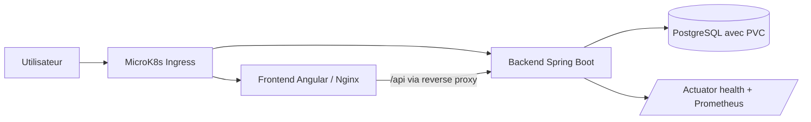
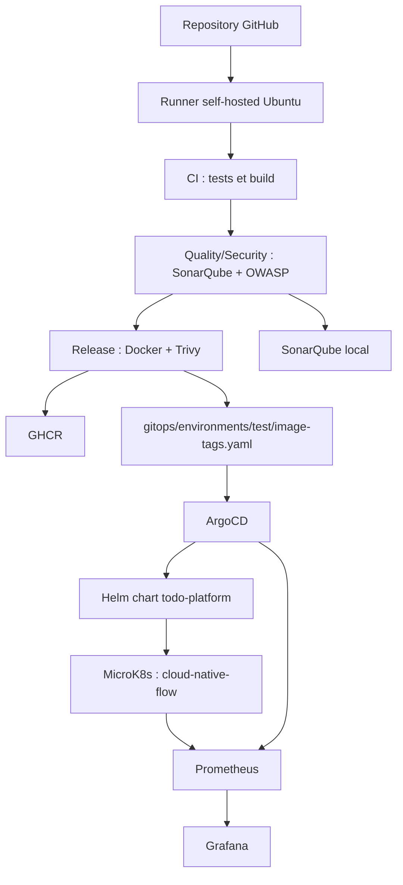
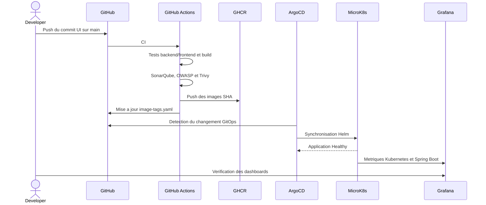

# Architecture du projet

## Vue applicative

Le frontend est servi par Nginx. Les appels commencant par `/api` sont
rediriges vers le Service Kubernetes `backend`. Le backend utilise PostgreSQL
et expose ses metriques sur `/actuator/prometheus`.

## Vue plateforme

## Flux de livraison

## Responsabilites des composants

| Composant | Responsabilite |
|---|---|
| GitHub | Versionner le code et les configurations |
| GitHub Actions | Automatiser validation, securite et release |
| GHCR | Stocker les images Docker immuables par SHA |
| Helm | Decrire le deploiement parametrable |
| ArgoCD | Reconciler Git et etat Kubernetes |
| MicroK8s | Executer les workloads sur la VM Ubuntu |
| Prometheus | Collecter les metriques |
| Grafana | Visualiser et explorer les metriques |
